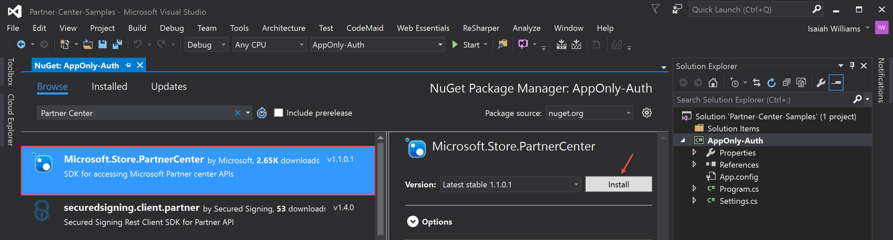

# Microsoft Partner Center App Only Auth Sample #

This sample code was developed as aide for the [Partner Center API App Only Authentication](http://blogs.msdn.microsoft.com/iwilliams/) blog entry.
The code shows how to perform basic operations with the Parnter Center API.  App only authentication is where the client identifier and client secret
are used to obtain a token for the application itself. This is possible because the application in Azure AD has a secret, also known as a password,
that is used to verify the application’s identity. This type of authentication is typically used by APIs and websites.

### Requirements ###

Prior to executing this code the following settings need to be configured in the *__app.config__*

* ApplicationId
* ApplicationSecret
* TenantId

Please the blog entry referenced above for mor details on how to obtain the appropriate value for each setting.

### Explanation ###

This sample project utilizes the Partner Center SDK in order to properly authenticate and obtain a list of customers. The 
*__Microsoft.Store.PartnerCenter__* NuGet package was added to the project in order to be able to reference the required 
objects



Before obtaining to list of customer the appropriate authentication tokens must be obtained. Since app only authentication 
is being utilized the *PartnerCredentials.Instance.GenerateByApplicationCredentials* function can be utilized to obtain the 
necessary token. 

If you are not using the Partner Center SDK then you can make the following HTTP request in order to obtain the required 
authorization token.

```
POST https://login.windows.net/{INSERT-TENANT-ID-HERE}/oauth2/token HTTP/1.1
Content-Type: application/x-www-form-urlencoded
Host: login.windows.net
Content-Length: 184
Expect: 100-continue
Connection: Keep-Alive

resource=https%3A%2F%2Fgraph.windows.net&client_id={INSERT-APPLICATION-ID}&client_secret={INSERT-APPLICATION-SECRET-HERE}&grant_type=client_credentials
```

Once you the necessary authorization token you can perform various operations using the Partner Center SDK. One such operation is obtaining 
a list of customers, and that can be done using the following code

```C#
PartnerContext context;
SeekBasedResourceCollection<Customer> customers;

try
{
    context = new PartnerContext();
    customers = context.GetPartnerOperations().Customers.Get();

    foreach (Customer c in customers.Items)
    {
        Console.WriteLine(c.CompanyProfile.CompanyName);
    }
}
finally
{
    context = null;
    customers = null;
}
````

If you are not using the Partner Center SDK then you can make the following HTTP reqeust in order to obtain a list of customers

```
GET https://api.partnercenter.microsoft.com/v1/customers HTTP/1.1
Authorization: Bearer {INSERT-ACCESS-TOKEN-VALUE-HERE}
Accept: application/json
MS-RequestId: {INSERT-GUID-HERE}
MS-CorrelationId: {INSERT-GUID-HERE}
X-Locale: en-US
Host: api.partnercenter.microsoft.com
```

### References ###

* [Authentication Scenarios for Azure AD](https://azure.microsoft.com/en-us/documentation/articles/active-directory-authentication-scenarios/)
* [Module 2 Authentication for Partner Center SDK](https://channel9.msdn.com/Series/cspdev/Module-2-Authentication-for-Partner-Center-SDK)
* [Partner Center Authentication](https://msdn.microsoft.com/en-us/library/partnercenter/mt634709.aspx)